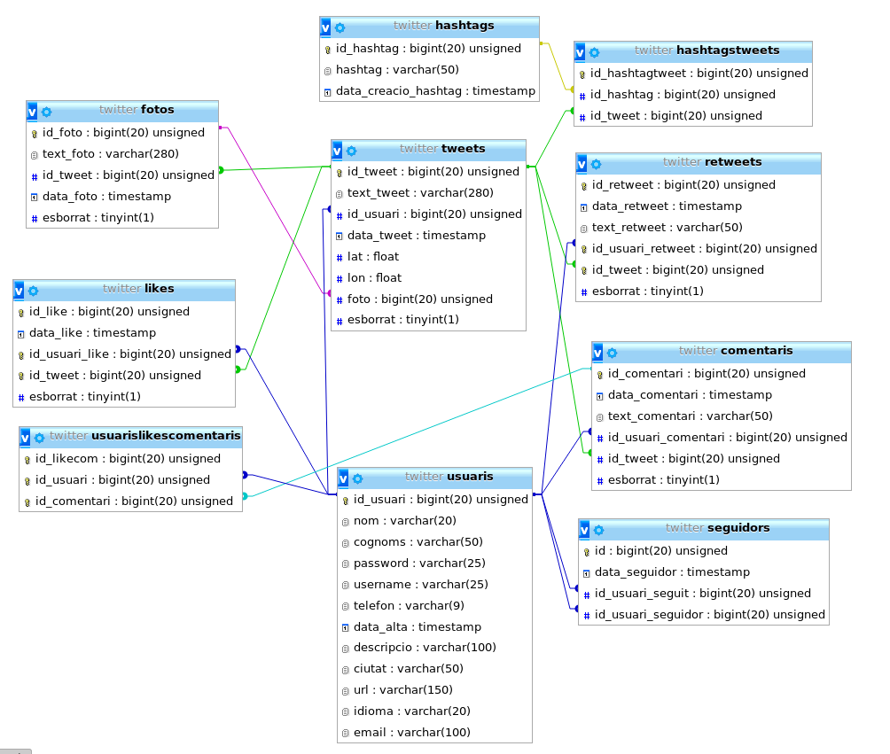
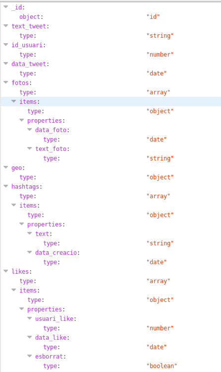
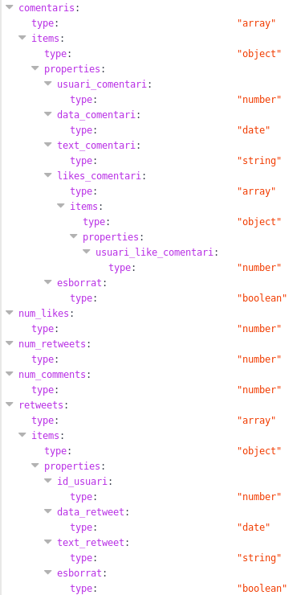
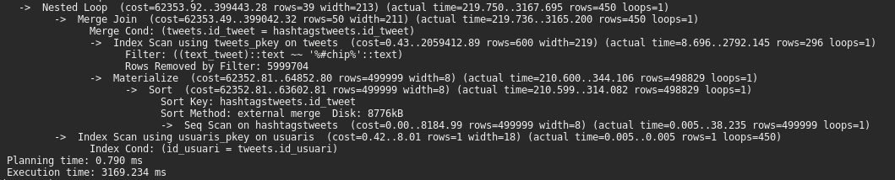
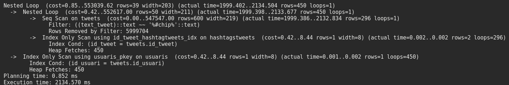

# Project documentation

The aim of this project is to let you know the great potential of NoSQL 
databases when we have to process big data volumes.

Syntax used in MongoDB differs from Postgres, but it's really simple to understand. 
In this project you will see how to use syntax in MongoDB and Postgres.


## A little bit of information

MongoDB is an open source database. It’s designed to be agile and scalable, 
and it uses dynamic schemas so that you can create records without defining the structure first. 
It also supports hierarchical documentation of data.

PostgreSQL is also open source, but it’s a relational database, 
that means it is much more concerned about how we store data. 
It's really important defining an ordered structure so that we can create coherent information.

Over the past decade, many of the assumptions that drove the development of relational databases have changed:

* Demands for higher developer productivity and faster time to market.

* The need to manage massive increases in new, rapidly changing data types.

* Exploit on-demand, highly scalable compute and storage infrastructure, with the ability to serve audiences any place they work.
  
As a result, non-relational or “NoSQL” databases, like MongoDB, have appeared in order to address the requirements of new applications such as:

* High scalability

* Availability

* Developer productivity


### Concepts

   Many concepts in PostgreSQL have analogs in MongoDB. The table below shows the common concepts.


   PostgreSQL    |    MongoDB
   --------------|------------------------
   Table         |   Collection
   Row           |   Document
   Column        |   Field
   JOIN          |   Embedded documents
   GROUP_BY      |   Aggregation Pipeline


---

## Installation

Now it is explained how can we test both interfaces with more or less the same configuration in our system.

## System specifications

This project has been made in Linux Fedora 24.
The main details of my Fedora machine are:

* Processor: Intel Core (TM) i7-6700 CPU @ 3.40GHz
* RAM: 16 GB
* HDD: 225 GB
* Swap: 5 GB
* System type: 64 bits


## Environment preparation

First of all, before we start analyzing Postgres and MongoDB we should prepare 
the environment where we are going to use both interfaces.

To do it we should first install **Postgres** and **MongoDB** in our system.


### Postgres installation

To install Postgres in the system we should follow the [_HowToPostgres_](https://github.com/isx45128227/MongoVsPostgres/blob/master/HowToInstallPostgres.md#postgres-installation) created.
  
Once we have finished installing Postgres we need to continue installing MongoDB.
  
### MongoDB installation

To install MongoDB in the system we should follow the [_HowToMongoDB_](https://github.com/isx45128227/MongoVsPostgres/blob/master/HowToInstallMongoDB.md#mongodb-installation) created.


#### Now we have both interfaces installed in our system, so in order to have data to process, we should create a database.

---

### Starting up the database

In this project we are going to work with **Twitter** database.
We have to create two different structures, one used in Postgres and the 
other one used in MongoDB.
 
The structure I have chosen for **Postgres** is:




This structure contains different tables and they are connected by using 
foreign keys (the _id_ of each table) in order to maintain the data coherence.

This coherence is important because we want to keep coherent data without repetitions.
The tables are connected as follows:

* Table **tweets** is connected with:

    * Usuaris to link each tweet with the owner.
    
    * Fotos to link each tweet with the pics it could have.
    
    
* Table **retweets** is connected with:

    * Usuaris to link each retweet with the owner.
    
    * Tweets to link each retweet with the tweet.


* Table **fotos** is connected with:

    * Tweets to link each pic with the tweet.


* Table **likes** is connected with:

    * Tweets to link each like with the tweet.
    
    * Usuaris to link each like with the owner.


* Table **comentaris** is connected with:
    
    * Usuaris to link each comment with the owner.
    
    * Tweets to link each comment with the tweet.
    
    
* Table **usuarislikescomentaris** is connected with:

    * Usuaris to link each comment like with the owner.
    
    * Comentaris to link each comment like with the comment.


* Table **hashtagstweets** is connected with:

    * Tweets to link each hashtag ID with the tweet.
    
    * Hashtags to link each hashtag ID with the hashtag.


* Table **seguidors** is connected with:

    * Usuaris to link each follower with the user it follows.
    


The structure for **MongoDB** differs from Postgres because of the organization. 
MongoDB use collections instead of tables, there is no need to create one 
collection for each table used in Postgres so I have tried to maintain the same relations somehow.

* Users 


* Tweets 





Once we have defined the structure we are going to use, we can start creating the database.


### Database Twitter on Postgres

It is created a script that includes Twitter database, so the only thing
we have to do is to import that script.


* First of all we init session in postgres.

    `[root@host ]# su - postgres`

* Later we init the database agent.

    `-bash-4.3$ psql`

* Once we have entered to Postgres, we can import the database structure using the [script](https://github.com/isx45128227/MongoVsPostgres/blob/master/Postgres/twitterhashtags.sql) from /tmp, for example.

    `postgres=# \i /tmp/twitterhashtags.sql;`

* Now we have the complete database structure. We can check it by using:

    `twitter=# \d`

                          List of relations
                          
  Schema |                 Name                  |   Type   |  Owner
  -------|---------------------------------------|----------|-------------
  public | comentaris                            | table    | twitteradmin
  public | comentaris_id_comentari_seq           | sequence | twitteradmin
  public | fotos                                 | table    | twitteradmin
  public | fotos_id_foto_seq                     | sequence | twitteradmin
  public | hashtags                              | table    | twitteradmin
  public | hashtags_id_hashtag_seq               | sequence | twitteradmin
  public | hashtagstweets                        | table    | twitteradmin
  public | hashtagstweets_id_hashtagtweet_seq    | sequence | twitteradmin
  public | likes                                 | table    | twitteradmin
  public | likes_id_like_seq                     | sequence | twitteradmin
  public | retweets                              | table    | twitteradmin
  public | retweets_id_retweet_seq               | sequence | twitteradmin
  public | seguidors                             | table    | twitteradmin
  public | seguidors_id_seq                      | sequence | twitteradmin
  public | tweets                                | table    | twitteradmin
  public | tweets_id_tweet_seq                   | sequence | twitteradmin
  public | usuaris                               | table    | twitteradmin
  public | usuaris_id_usuari_seq                 | sequence | twitteradmin
  public | usuarislikescomentaris                | table    | twitteradmin
  public | usuarislikescomentaris_id_likecom_seq | sequence | twitteradmin


  Here we see that for each table it is created a sequence, that means that 
  each single table has an _id_ field that is bigserial and this serial is
  a sequence of numbers starting at 1. 
  We use this in order to maintain coherence on the database.


* Later we have to import all data in our tables so as to have a lot of information to process. 

    I have created _Python_ scripts which generate lots of data to add to twitter database. 
    They are placed in [Postgres/Funcions populate](https://github.com/isx45128227/MongoVsPostgres/tree/master/Postgres/Funcions%20populate). 
    
    There is one script for each table, and the only thing we have to do to obtain 
    that big amount of data is to execute the script and redirect the output to a file.

    * First we create information of hashtags table with the script and put it in /tmp directory:
    
        `[user@host ]$ python populate_hashtags.py > /tmp/hashtags.csv`

    * Then we import data from /tmp to twitter database:
    
        `twitter=# COPY hashtags FROM '/tmp/hashtags.csv' DELIMITER ',' CSV HEADER;`

    * That is the process we should follow for each table. 
      Take into account that every script generates different data, and it is not necessary all table data.

        `twitter=# COPY usuaris FROM '/tmp/usuaris.csv' DELIMITER ',' CSV HEADER;`
        
        `twitter=# COPY tweets(id_tweet,text_tweet,id_usuari,data_tweet) FROM '/tmp/tweets.csv' DELIMITER ',' CSV HEADER;`
        
        `twitter=# COPY fotos(id_foto,text_foto,id_tweet,data_foto) FROM '/tmp/fotos.csv' DELIMITER ',' CSV HEADER;`
        
        `twitter=# COPY likes(id_like,data_like,id_usuari_like,id_tweet) FROM '/tmp/likes.csv' DELIMITER ',' CSV HEADER;`
        
        `twitter=# COPY seguidors FROM '/tmp/seguidors.csv' DELIMITER ',' CSV HEADER;`
        
        `twitter=# COPY retweets(id_retweet,data_retweet,text_retweet,id_usuari_retweet,id_tweet) FROM '/tmp/retweets.csv' DELIMITER ',' CSV HEADER;`
        
        `twitter=# COPY comentaris(id_comentari,data_comentari,text_comentari,id_usuari_comentari,id_tweet) FROM '/tmp/comentaris.csv' DELIMITER ',' CSV HEADER;`
        
        `twitter=# COPY hashtagstweets FROM '/tmp/hashtagstweets.csv' DELIMITER ',' CSV HEADER;`
        
        `twitter=# COPY usuarislikescomentaris FROM '/tmp/usuarislikescomentaris.csv' DELIMITER ',' CSV HEADER;`


        #### Script name and the table associated with
         
        Table                  | Script
        -----------------------|-------------------------------------------
        comentaris             | populate_comentaris.py    
        fotos                  | populate_fotos.py   
        hashtags               | populate_hashtags.py    
        hashtagstweets         | populate_hashtagstweets.py    
        likes                  | populate_likes.py    
        retweets               | populate_retweets.py   
        seguidors              | populate_seguidors.py    
        tweets                 | populate_tweets.py    
        usuaris                | populate_usuaris.py   
        usuarislikescomentaris | populate_usuarislikescomentaris.py    


        There are other tools that can populate data into Postgres database. 
        The most commonly used is [*pg_loader*](http://pgloader.readthedocs.io/en/latest/tutorial/tutorial.html) 
        that works with lots of data, but in this case we use an easier method.


With the structure followed, in table tweets we don't have the text used in hashtags if they are used in. 
So in order to add the hashtag to the tweet so we can **search in tweets table directly**, 
there is a function in PLPGSQL that adds the hashtag to each tweet.
Once we have added all information to twitter database we should run this function. 

* First of all we import the [function](https://github.com/isx45128227/MongoVsPostgres/blob/master/Postgres/funcio_plpgsql.sql) from /tmp, for example.

    `twitter=# \i /tmp/funcio_plpgsql.sql;`

* Then we run the function

    `twitter=# SELECT update_tweets();`
    

Finally, in order to have access to the Postgres database with other users we need to add some roles.

* First we import the [script](https://github.com/isx45128227/MongoVsPostgres/blob/master/Postgres/privileges.sql) that grant access to our username, but
  before importing that script, we should **make changes** on it.
    
    * Everywhere it says **YourUsername** change it with your username.
    
    * Change password with the one you want to use.
  
    * Now you are ready to import it from /tmp, for example.

        `twitter=# \i /tmp/privileges.sql;`
    
* Then we run a different terminal and ensure that we can log into database with the **username** we put on the script by using:

    `[user@host]$ psql -p 5432 -U username -d twitter`


##### Now we have finished creating Twitter database on Postgres. 

---

### Postgres database to MongoDB

Once we have created the Postgres database we can export all data into _json_ format.
MongoDB use _json_ documents to order the information into collections.

Postgres has different functions that can convert from Postgres language to _json_ files.
The only thing we have to do is to execute that function and see the result.

  ```
  twitter=# SELECT row_to_json(users) FROM (SELECT id_usuari,nom,cognoms,
             password,username,telefon,data_alta,descripcio,ciutat,url,idioma,
             email,(SELECT array_to_json(array_agg(row_to_json(followers))) FROM 
             (SELECT data_seguidor,id_usuari_seguidor FROM seguidors WHERE 
             id_usuari=id_usuari_seguit) followers) as seguidors FROM usuaris) users;
  ```
  ```
  Result: {"id_usuari":12592,
            "nom":"pere",
            "cognoms":"goñi",
            "password":"pass12592",
            "username":"pere_goñi_12592",
            "telefon":"698543568",
            "data_alta":"2018-04-23T09:29:00",
            "descripcio":"usuari peregoñi",
            "ciutat":"colonia",
            "url":"https://www.twitter.com/pere_goñi12592",
            "idioma":"castella",
            "email":"peregoñi12592@gmail.com",
            "seguidors":null }
  ```

Here we are creating an output in _json_ format with all information about users and their followers.

That's fine if we only want to see the output, but we have to create a full database _json_ files.

As said before, MongoDB's organization is different from Postgres, 
so we are going to create **two** different collections for MongoDB called **users** and **tweets**. 

As I have tested, two days after executing the function without having indexes in Postgres 
the results haven't appeared (we must take into account that there are more than 3 million rows).
 
To solve this, I added indexes to Postgres database in order to reduce the number 
of accesses to each table and to obtain the result faster (if we don't use indexes 
it will cost a lot of time to generate _json_ files).

Every index is created in a field that is linked to another table.

We just need to add indexes in Postgres:

* First of all we create index in **tweets** table

    ```
      twitter=# CREATE INDEX id_usuari_tweets_idx ON tweets (id_usuari);
      twitter=# CREATE INDEX id_foto_tweets_idx ON tweets (foto);
    ```

* Secondly we create index in **comentaris** table

    ```
      twitter=# CREATE INDEX id_usuari_comentari_idx ON comentaris (id_usuari_comentari);
      twitter=# CREATE INDEX id_tweet_idx ON comentaris (id_tweet);
    ```

* Thirdly  we create index in **likes** table

    ```
      twitter=# CREATE INDEX id_usuari_comentari_likes_idx ON likes (id_usuari_like);
      twitter=# CREATE INDEX id_tweet_likes_idx ON likes (id_tweet);
    ```
    
* Fourthly we create index in **usuarislikescomentaris** table

    ```
      twitter=# CREATE INDEX id_usuari_usuarislikescomentaris_idx ON usuarislikescomentaris(id_usuari);
      twitter=# CREATE INDEX id_comentari_usuarislikescomentaris_idx ON usuarislikescomentaris(id_comentari);
    ```

* Fifthly we create index in **fotos** table

    ` twitter=# CREATE INDEX id_tweet_fotos_idx ON fotos (id_tweet);`

* Sixthly we create index in **retweets** table

    ```
      twitter=# CREATE INDEX id_usuari_retweets_idx ON retweets(id_usuari_retweet);
      twitter=# CREATE INDEX id_tweet_retweets_idx ON retweets (id_tweet);
    ```

* Seventhly we create index in **hashtagstweets** table

    ```
      twitter=# CREATE INDEX id_tweet_hashtagtweets_idx ON hashtagstweets (id_tweet);
      twitter=# CREATE INDEX id_hashtag_hashtagtweets_idx ON hashtagstweets (id_hashtag);
    ```

* Lastly we create index in **seguidors** table

    ```
      twitter=# CREATE INDEX id_usuariseguit_idx ON seguidors(id_usuari_seguit);
      twitter=# CREATE INDEX id_usuariseguidor_idx ON seguidors(id_usuari_seguidor);
    ```


After adding the indexes we are ready to create _json_ files. 
We just need to follow the next steps:

* Obtain users data and redirect the output to a file,
  so as to have all users information (user password is **jupiter**). 

    ```
    [user@host ]$ psql -p 5432 -U postgres -d twitter -c 
    'SELECT row_to_json(users) FROM 
    (SELECT id_usuari,nom,cognoms,password,username,
       telefon,data_alta,descripcio,ciutat,url,idioma,email,
       (SELECT array_to_json(array_agg(row_to_json(followers))) FROM 
         (SELECT data_seguidor,id_usuari_seguidor FROM seguidors 
          WHERE id_usuari=id_usuari_seguit) followers) as seguidors FROM 
          usuaris) users 
    ORDER BY users.id_usuari;' > /tmp/users.json
   ```

* Obtain tweets data and redirect the output to a file, in order to have all tweets information (user password is **jupiter**). 

    ```
    [user@host ]$ psql -p 5432 -U postgres -d twitter -c 
        'SELECT row_to_json(tweets) FROM 
          (SELECT id_tweet AS "_id",
           text_tweet,
           id_usuari,
           data_tweet,
           (SELECT array_to_json(array_agg(row_to_json(fotos))) FROM 
             (SELECT data_foto,text_foto FROM fotos 
               WHERE tweets.id_tweet=fotos.id_tweet) fotos) as fotos,
           (SELECT row_to_json(row(lat,lon))) AS "geo",
           (SELECT array_to_json(array_agg(row_to_json(hashtags))) FROM 
             (SELECT hashtag,data_creacio_hashtag FROM hashtags JOIN hashtagstweets 
              ON hashtags.id_hashtag=hashtagstweets.id_hashtag 
              WHERE tweets.id_tweet=hashtagstweets.id_tweet) hashtags) as hashtags,
           (SELECT array_to_json(array_agg(row_to_json(likes))) FROM 
             (SELECT id_usuari_like,data_like,esborrat FROM likes 
              WHERE tweets.id_tweet=likes.id_tweet) likes) as likes,
           (SELECT array_to_json(array_agg(row_to_json(comentaris))) FROM 
             (SELECT id_usuari_comentari,data_comentari,text_comentari,
               (SELECT array_to_json(array_agg(row_to_json(likescomentari))) FROM 
                 (SELECT id_usuari FROM usuarislikescomentaris 
                  WHERE comentaris.id_comentari=usuarislikescomentaris.id_comentari) 
                  likescomentari) as "likes_comentari" 
                 FROM comentaris WHERE tweets.id_tweet=comentaris.id_tweet) 
                 comentaris) as comentaris,
           (SELECT count(*) FROM likes WHERE tweets.id_tweet=likes.id_tweet) AS "num_likes",
           (SELECT count(*) FROM retweets WHERE tweets.id_tweet=retweets.id_tweet) AS "num_retweets",
           (SELECT count(*) FROM comentaris WHERE tweets.id_tweet=comentaris.id_tweet) AS "num_comments",
           (SELECT array_to_json(array_agg(row_to_json(retweets))) FROM (SELECT id_usuari_retweet,data_retweet,
            text_retweet,esborrat FROM retweets WHERE tweets.id_tweet=retweets.id_tweet) retweets) as retweets
         FROM tweets) tweets;' > /tmp/tweets.json
    ```


Function _row_to_json_ converts row into _json_ document. 
That means that we can transform each row of our table in Postgres into 
different documents in _json_ format. 

Function _array_agg_ creates an array of objects. 
In this case we use this function to create different arrays of objects such as hashtags, followers and photos.


### Database Twitter on MongoDB

Finally, we have to add Twitter database to MongoDB. 
In this case is not necessary to run the interface. 
We can directly import database from _json_ or _csv_ file to the interface.

In this case we have **two** json files, the first one includes 
**tweets collection** and the second one includes **users collection**.

* First we import users collection.

    `[user@host ]$ mongoimport --db twitter --collection users --file /tmp/users.json --jsonArray`

* Then we import tweets collection.

    `[user@host ]$ mongoimport --db twitter --collection tweets --file /tmp/tweets.json --jsonArray`


##### Now we have finished creating Twitter database on MongoDB. 

---

Once we have added all information to Twitter database we can start using it. 

* First of all we enter to MongoDB interface.

    `[user@host ]$ mongo`

* Once we have entered to MongoDB, we have to choose the database we want to work with.

    `> use twitter`

* Later we can see the different collections by using
    
    `> show collections`
    
* Other way to connect with mongo is specifying the database we want to connect with in the command line.

    `[user@host ]$ mongo twitter`

* To select collections we want to work with we should specify in the find sentence.

   Working on users collection:
       
   `> db.users.find()`
    
   or working on tweets collection: 
   
   `> db.tweets.find()`

---

### Query Documents

As I said at the very beginning of this project syntax in MongoDB differs from Postgres.

Here you can see basic CRUD queries in Postgres and their translation into MongoDB's syntax.

PostgreSQL                                                                                                        | MongoDB
------------------------------------------------------------------------------------------------------------------|-------------------------------------------------------------------------------
`CREATE TABLE tweets (id_tweet bigserial PRIMARY KEY,text_tweet varchar(280) NOT NULL,id_usuari bigint NOT NULL);`| Not Required
`INSERT INTO tweets(id_tweet,text_tweet,id_usuari)VALUES (DEFAULT,'Example tweet',1);`                            | `db.tweets.insert({ id_tweet: 1, text_tweet:'Example tweet', id_usuari: 1 })`
`SELECT * FROM tweets;`                                                                                           | `db.tweets.find()` 
`UPDATE tweets SET id_usuari = 2999 WHERE id_tweet=3000;`                                                         | `db.tweets.update({ id_usuari: 2999 },{ $set: { id_tweet: 3000 } },{ multi: true })`
`DELETE FROM tweets WHERE id_tweet=3000;`                                                                         | `db.tweets.remove({ _id: 3000 })`
`SELECT id_usuari,count(*) FROM tweets GROUP BY id_usuari ORDER BY id_usuari;`                                    | `db.tweets.aggregate([ { "$group": { "_id": "$id_usuari", "num": {"$sum":1}}},{"$project": {"_id": false, "id_usuari":"$_id", "numTweets": "$num"}},{"$sort": { "id_usuari": 1}}])`


---


## Testing query performance

Once we have the system with both interfaces, we are able to start 
testing different queries to compare speed rates and the number of accesses.


* First of all we are going to test both databases without indexes.


* To begin with we should remove indexes we have created before on Postgres.

    There is a script we can use to DROP all indexes. It is placed in [Postgres/delete_indexs.sql](https://github.com/isx45128227/MongoVsPostgres/blob/master/Postgres/delete_indexs.sql).
    We enter to Twitter database and import the script.
    
    `twitter=# \i /tmp/delete_indexs.sql` 


* Now we are ready to execute different queries on both interfaces and see the result.

    * First we are going to find tweets that contains the hashtag _#chip_.
    
        #### Postgres

        ```
        twitter=# SELECT tweets.text_tweet FROM tweets JOIN usuaris ON 
        tweets.id_usuari=usuaris.id_usuari JOIN hashtagstweets ON 
        tweets.id_tweet=hashtagstweets.id_tweet WHERE text_tweet 
        LIKE '%#chip%';
        ```
        ```
        Result (only the first one): Tweet 4947 de prova d'un usuari que
        ha d'ocupar com a maxim 280 caracters per comparar Mongo amb Postgres. 
        que la seva ocupacio ha de ser com a maxim 280 caracters per 
        comparar Mongo amb Postgres. #chip #variation
        ```
        
        
        #### MongoDB
        
        `> db.tweets.find({ "text_tweet":/#chip/},{"text_tweet":1,"_id":0})`
        
        ```
        Result (only the first one): `"text_tweet" : "Tweet 4947 de prova
        d'un usuari que ha d'ocupar com a maxim 280 caracters per comparar Mongo 
        amb Postgres. que la seva ocupacio ha de ser com a maxim 280 caracters 
        per comparar Mongo amb Postgres. #chip #variation"
        ```
        
        
    * We can obtain the cost by doing:
        
        #### Postgres
        
        ```
        twitter=# EXPLAIN ANALYZE SELECT tweets.text_tweet FROM tweets 
        JOIN usuaris ON tweets.id_usuari=usuaris.id_usuari JOIN hashtagstweets
        ON tweets.id_tweet=hashtagstweets.id_tweet WHERE text_tweet 
        LIKE '%#chip%';
        ```
            
        


        #### MongoDB

        `> db.tweets.find({ "text_tweet":/#chip/},{"text_tweet":1,"_id":0}).explain("executionStats")`

        
            
            
    * Now we are ready to analyze what it happened.
       
        #### Postgres
        
        As we see on the result, Postgres builds a tree structure representing 
        the different actions taken, with the root and each -> pointing to one of them. 
        Each tree’s branches represent sub-actions, and you’d work inside-out to determine what’s happening first.
        
        In this plan, we have a nested-loop join node with three table scans as inputs. 
        The indentation of the node summary lines reflects the plan tree structure.
        
        We can see different parts on the result: 
           
        * Merge Join: shows the time spent on joining the different tables.
        
        * Merge Cond: shows the condition used by the join.
        
        * Index scan: shows indexs used during the search, in this case, only primary keys.
        
        * Rows removed: only appears when at least one scanned row, or potential join pair in the case of a join node, is rejected by the filter condition.
        
        * Sort: shows the sort method used (in particular, whether the sort was in-memory or on-disk) and the amount of memory or disk space needed.
           
        Finally, we see the planning time and the execution time. 
        The most important one is the execution time, that is the one that reflects the whole time spent on making the query.
        
        

        
        #### MongoDB
    
        On the other hand, MongoDB represents the execution plan into 
        a _json_ document. We can focus on three different parts of the result:
        
        * The most important is the _cursor_. When _BasicCursor_ is displayed, 
          it means that a collection scan has been made, 
          so mongo had to scan the entire collection document by document to identify the results. 
          This is generally an expensive operation and can result in slow queries.
        
        * _n_ displays the matches made with the query.
        
        
        * Now we focus on _nscanned_ and _nscannedObjects_, that is 6000000, 
          this is the number of documents scanned to match the _n_ results.
          That happens when we don't use Indexs to reduce the number of accesses.
        
        The difference between the number of matching documents and the 
        number documents scanned may suggest that, to improve efficiency, 
        the query might benefit from the use of an index.
          

    * How can we solve this? Just adding Indexs on both interfaces and 
      see if they improve their performance.
    
        #### Postgres
        
        * As we did before, we need to add indexes to every single field 
          that is related to another table. 
          Here it is shown the different tables and the fields that are joined to other tables.
          
        
          Table                   |        Field           |  Relation           
          ------------------------|------------------------|-------------------
          Tweets                  | id_usuari              | Table usuaris 
          Tweets                  | foto                   | Table fotos 
          Comentaris              | id_usuari_comentari    | Table usuaris 
          Comentaris              | id_tweet               | Table tweets 
          Likes                   | id_usuari_like         | Table usuaris
          Likes                   | id_tweet               | Table tweets
          Usuarislikescomentaris  | id_usuari              | Table usuaris 
          Usuarislikescomentaris  | id_comentari           | Table comentaris 
          Fotos                   | id_tweet               | Table tweets
          Retweets                | id_usuari_retweet      | Table usuaris 
          Retweets                | id_tweet               | Table tweets
          Hashtagstweets          | id_tweet               | Table tweets
          Hashtagstweets          | id_hashtag             | Table hashtags
          Seguidors               | id_usuari_seguit       | Table usuaris 
          Seguidors               | id_usuari_seguidor     | Table usuaris 
        

        * Now we create the indexs.
        
            #### TWEETS

            ```
              twitter=# CREATE INDEX id_usuari_tweets_idx ON tweets (id_usuari);
              twitter=# CREATE INDEX id_foto_tweets_idx ON tweets (foto);
            ```
            
            #### COMENTARIS 
            
            ```
              twitter=# CREATE INDEX id_usuari_comentari_idx ON comentaris (id_usuari_comentari);
              twitter=# CREATE INDEX id_tweet_idx ON comentaris (id_tweet);
            ```
            
            #### LIKES
            
            ```
              twitter=# CREATE INDEX id_usuari_comentari_likes_idx ON likes (id_usuari_like);
              twitter=# CREATE INDEX id_tweet_likes_idx ON likes (id_tweet);
            ```
            
            #### USUARISLIKESCOMENTARIS
            
            ```
              twitter=# CREATE INDEX id_usuari_usuarislikescomentaris_idx ON usuarislikescomentaris(id_usuari); 
              twitter=# CREATE INDEX id_comentari_usuarislikescomentaris_idx ON usuarislikescomentaris(id_comentari);
            ```
            
            #### FOTOS
            
            ` twitter=# CREATE INDEX id_tweet_fotos_idx ON fotos (id_tweet);`
            
            #### RETWEETS
            
            ```
              twitter=# CREATE INDEX id_usuari_retweets_idx ON retweets(id_usuari_retweet);
              twitter=# CREATE INDEX id_tweet_retweets_idx ON retweets (id_tweet);
            ```
            
            #### HASHTAGSTWEETS
            
            ```
              twitter=# CREATE INDEX id_tweet_hashtagtweets_idx ON hashtagstweets (id_tweet);
              twitter=# CREATE INDEX id_hashtag_hashtagtweets_idx ON hashtagstweets (id_hashtag);
            ```
            
            #### SEGUIDORS
            
            ```
              twitter=# CREATE INDEX id_usuariseguit_idx ON seguidors(id_usuari_seguit);
              twitter=# CREATE INDEX id_usuariseguidor_idx ON seguidors(id_usuari_seguidor);
            ```
        
        
        #### MongoDB
        
        Now we add the Index in MongoDB. The syntax and their creation
        differs from Postgres, but it has the same effect. 
        
        That index can search in MongoDB as it was Google Search.
        To do it we should follow this step:

        `> db.tweets.createIndex({text_tweet:"text"},{"name":"cerca_paraules_tweet"})`
           
           
    * Once we have created the indexes on both interfaces we can repeat 
      the previous process to see what has changed.
    
        #### Postgres
        
        We repeat the query to see the execution process.
        
        ```
        twitter=# EXPLAIN ANALYZE SELECT tweets.text_tweet FROM tweets 
                  JOIN usuaris ON tweets.id_usuari=usuaris.id_usuari JOIN hashtagstweets 
                  ON tweets.id_tweet=hashtagstweets.id_tweet WHERE text_tweet 
                  LIKE '%#chip%';
        ```
         
        
        
        In this case, we have two nested-loops. On the second one we see that is made a sequential scan
        on tweets table, that is because there are many more rows to be visited in that table, so it is 
        necessary to filter first. Then we see the number rows removed using this scan (with the filter condition)
        and the indexes used to resolve the query as fast as Postgres can.
        
        The new part seen on this plan is the _Heap Fetches_.
        This is the number of visits that are projected to be needed by the planner goes up,
        that means the number of results that match the condition.
        
        Finally, we see the planning time and the final execution time.
        This time is one second faster than the plan without indexes, so we can conclude that indexes help Postgres
        to search faster.
        
        
        #### MongoDB
        
        Having created the index as if it was Google Search, we should use another way to search the previous query.

        `> db.tweets.find({$text:{$search:"/#chip/"}},{"text_tweet":1,"_id":0}).explain("executionStats")`
        
        
        
        This time we see that the result has changed. We must focus on four different parts:
        
        * _cursor_ this time displays _TextCursor_ to indicate index used and its name. 
        
        * _n_ displays the number of matches made with the query.
        
        * _nscanned_ displays 296 to indicate that MongoDB scanned 296 index entries. 
          So we have reduced the number of objects scanned from 6 million to 296.

        * _nscannedObjects_ displays 296 to indicate that MongoDB scanned 296 documents. 
          Again we reduced the number of objects scanned from 6 million to 296.
          
          
        There is also a possibility of querying JOINS in MongoDB. If we want to reproduce the query made in Postgres
        we just need to create a function in javascript. It is simple, we have to do the first query in one collection
        and then obtain the rest from the other collection using a cursor. Let's see an example:
        
        ```javascript
        function join_tweets_usuaris(query) {
        var result = db.tweets.find(query);
        var sortida = '';
        while ( result.hasNext()) {
           var usuari = tojson (result.next().id_usuari);
           var info_usuari = db.users.find({"id_usuari":parseInt(usuari)});
           var dades_usuari = info_usuari.next();
           if (dades_usuari.seguidors){
              sortida = sortida + " | " + usuari+" "+dades_usuari.nom + " " + dades_usuari.seguidors.length;
           }
           else
           {
              sortida = sortida + " | " + usuari+" "+dades_usuari.nom + "  0";
           }
           
        }
        printjson(sortida);
        }
       ```
       
       


## Query attack 

Once we have tested the query performance with only one query at the same 
time and having dedicated all machine, we must try what would 
happen if multiple queries are sent at the same time so that we can analyze
what results do we obtain if we implement and use this structure.

### Postgres

To execute multiple queries at the same time we should send the psql command to the terminal.
In order to do that process massively, it is more practical to create a script.

The script I have prepared calls different sub_scripts that generate the calls to psql.
You can find it in [Postgres/Atac](https://github.com/isx45128227/MongoVsPostgres/blob/master/Postgres/Atac/atac.sh).

Before we execute the script and generate that big amount of calls to Postgres, we should make changes in the configuration file
so that we can create logs of the different connections. It is really simple, you only need to follow this steps:

* First of all we log in as a superuser in order to make changes to Postgres configuration file.

    `[user@host ]$ su -`
  
* Then we edit the file located in _/var/lib/pgsql/data/_ that is called _postgresql.conf_.

    `[root@host ]# vim /var/lib/pgsql/data/postgresql.conf`
  
* And we add the next lines.

    ```
    max_connections = 1000
    shared_buffers=248MB
    
    log_destination = 'stderr'
    log_filename = 'postgresql-QUERIES.log' 
    log_connections = on
    log_duration = on
    log_hostname = on
    log_min_duration_statement = 3000
      # 0 --> Logs all statements
      # -1 --> Disabled logging
      # > 0 --> Log only statements running at least this number of milliseconds.
      
    effective_cache_size = 1MB
    ```
    
    Here we are telling Postgres the maximum number of connections allowed at the same time(1000),
    the memory dedicated to postgresql to use for caching data(248MB),
    the log filename, the information we want to see in the log 
    (log_connection, log_duration and log_hostname), what we want to log (queries longer than 3 seconds)
    and the minimum cache possible 1MB (in ordrer to execute the query each time).
    
    
    * We would also have to edit /etc/sysctl.conf to increase kernel max size to be larger than shared_buffers.
      Set the parameter as shown below.

        `kernel.shmmax=100663296` 
       
    
* Now we have to restart the service so the changes are effective.
  
    `[root@host ]# systemctl restart postgresql`


To execute that script, you should first change permissions to that file so it is executable.

`[user@host ]$ chmod +x atac.sh`
  
Later you execute the script and see the results on Postgres log.

`[user@host ]$ ./atac.sh`
  
To filter the result from the log and see only the time spent on each query we can do it as follows (**you must be root**):

`[root@host ]# grep "ms  statement: SELECT" /var/lib/pgsql/data/pg_log/postgresql-QUERIES.log`


### MongoDB

In MongoDB there is an option on the configuration file [systemLog](https://docs.mongodb.com/v2.6/reference/configuration-options/#systemlog-options)
that can create a log, but we are interested in how much time spend our queries.
So in order to know that amount of time we can create a function and call Mongo with [that function](https://github.com/isx45128227/MongoVsPostgres/blob/master/MongoDB/Atac/funcio_atac.js).

```javascript
function atac(query) {
  var data_inicial = new Date();
  var hora_inicial = data_inicial;
  var result = db.tweets.find(query);
  while ( result.hasNext()) {
     var usuari = tojson (result.next().id_usuari);
     printjson (usuari);   
     var data_final = new Date();
     var hora_final = data_final;
     var total = data_final.getTime()-data_inicial.getTime();
     }
  printjson(data_inicial+' Total: '+total);
}
atac({"text_tweet":/#chip/},{"id_usuari":1});
```

Here we are obtaining the initial time, executing the query and then obtaining the final time.

In order to do that process massively, it is more practical to create a script.

The script I have prepared calls different sub_scripts that generate the calls to MongoDB.
You can find it in [MongoDB/Atac](https://github.com/isx45128227/MongoVsPostgres/blob/master/MongoDB/Atac/atac.sh).


To execute that script, you should first change permissions to that file so it is executable.

   `[user@host ]$ chmod +x atac.sh`
  
Later you execute the script and see the results on MongoDB log.

   `[user@host ]$ ./atac.sh`
  
To filter the result from the log and see only the time spent on each query we can do it as follows:

   `[user@host ]$ grep "Total:" /tmp/MongoDB.log`


## Results

After executing both scripts in the interfaces, we see different results.

In Postgres it started fine, but once we have lots of queries at the same time the machine starts to 
slow its performance and to not accept more queries (running **four** attack scripts).

If we see the log, we could observe that it took a lot of time to return the result of the query.

Let's see what we obtained:

```
  [root@host ~]# grep "ms  statement: SELECT" /var/lib/pgsql/data/pg_log/postgresql-QUERIES.log
  LOG:  duration: 5254.795 ms  statement: SELECT DISTINCT tweets.id_tweet AS "id_tweet", 
  LOG:  duration: 4939.950 ms  statement: SELECT DISTINCT tweets.id_tweet AS "id_tweet", 
  LOG:  duration: 4394.036 ms  statement: SELECT DISTINCT tweets.id_tweet AS "id_tweet", 
  LOG:  duration: 10630.883 ms  statement: SELECT DISTINCT tweets.id_tweet AS "id_tweet", 
  LOG:  duration: 25276.824 ms  statement: SELECT DISTINCT tweets.id_tweet AS "id_tweet",
  LOG:  duration: 36685.197 ms  statement: SELECT DISTINCT tweets.id_tweet AS "id_tweet", 
  LOG:  duration: 42724.796 ms  statement: SELECT DISTINCT tweets.id_tweet AS "id_tweet",  
  LOG:  duration: 57065.766 ms  statement: SELECT DISTINCT tweets.id_tweet AS "id_tweet", 
  LOG:  duration: 68555.185 ms  statement: SELECT DISTINCT tweets.id_tweet AS "id_tweet", 
  LOG:  duration: 78819.674 ms  statement: SELECT DISTINCT tweets.id_tweet AS "id_tweet", 
  LOG:  duration: 98548.459 ms  statement: SELECT DISTINCT tweets.id_tweet AS "id_tweet", 
  LOG:  duration: 101269.874 ms  statement: SELECT DISTINCT tweets.id_tweet AS "id_tweet", 
```

We also see that the whole system was slow and sometimes having delays in responding to some actions.


On the other hand, MongoDB started nice and continued during all the time without 
rejecting any query (running also **four** attack scripts). 

Let's see what we obtained:

```
  [user@host ]$ grep "Total:" /tmp/MongoDB.log
  "Fri May 11 2018 11:51:17 GMT+0200 (CEST) Total: 12004"
  "Fri May 11 2018 11:51:19 GMT+0200 (CEST) Total: 13012"
  "Fri May 11 2018 11:51:26 GMT+0200 (CEST) Total: 22371"
  "Fri May 11 2018 11:51:27 GMT+0200 (CEST) Total: 35011"
  "Fri May 11 2018 11:51:29 GMT+0200 (CEST) Total: 42758"
  "Fri May 11 2018 11:51:32 GMT+0200 (CEST) Total: 60691"
  "Fri May 11 2018 11:51:32 GMT+0200 (CEST) Total: 59861"
  "Fri May 11 2018 11:51:33 GMT+0200 (CEST) Total: 60517"
  "Fri May 11 2018 11:51:34 GMT+0200 (CEST) Total: 69880"
  "Fri May 11 2018 11:51:39 GMT+0200 (CEST) Total: 71144"
  "Fri May 11 2018 11:51:44 GMT+0200 (CEST) Total: 62391"
```

Initially, it started to send responses in about 12 seconds, 
but later the time increases to 60 seconds (more or less).

The most important thing is that MongoDB did not stop sending responses 
and the system worked fine all the time without any delay.


## Conclusion

As seen on the results we can conclude that MongoDB was better than Postgres on the way it manages the 
distribution of connections. Nevertheless, Postgres has better organization and managing the coherence 
of data structure is easier.

MongoDB’s selection over Postgres is driven by developer productivity, performance, and scalability.
Before we start our project we should decide which is the better structure to use depending on the
necessities we have.

In addition, it is really important to think about the maintenance of the database, because focusing
on that, it is absolutely different one from the other. 
The main aspects we should consider are:

* Postgres has primary and foreign keys to prevent repetitions. MongoDB can have repeated rows.

* The structure followed is different.

* Querying in MongoDB is not as simple as it is in Postgres.

* The configuration of the logs is different.


On the other hand we have to take a look at the efficiency. As we have tested, there is a difference
between both interfaces, that does not mean that one have to be better than the other one. The fact
is that we have to think which fits better with the project we are developing. 

To sum up, it would be a good idea to use MongoDB in projects or applications where it is necessary
to have high-availability and scalability. 


## Docker interface

To test queries in Postgres and MongoDB interfaces I have created two different Dockers. 
Both of them include the entire twitter database without indexes.


### Postgres docker

* First of all we download and run Postgres docker from [DockerHub](https://hub.docker.com/r/isx45128227/postgrestwitter/), 
  where I have the image already created. 

    `[user@host ]$ docker run --name postgrestwitter -h postgrestwitter -d isx45128227/postgrestwitter`


* Later we run our queries using psql and user docker (user password is **jupiter**). 
  Check first the ip address of your docker, it could not be the same.
  You should wait a little bit until twitter database is ready (about 1 minute).

    `[user@host ]$ psql -h 172.17.0.2 -p 5432 -U docker -d twitter -c 'SELECT * FROM usuaris;'`
    
    `[user@host ]$ psql -h 172.17.0.2 -p 5432 -U docker -d twitter -c "SELECT count(*) FROM tweets WHERE text_tweet LIKE '%#sale%';"`
    
    `[user@host ]$ psql -h 172.17.0.2 -p 5432 -U docker -d twitter -c "SELECT * FROM tweets WHERE text_tweet LIKE '%#%';"`
    
  
  If we want to override the password prompt, we must add into our home a file named **.pgpass** that contains the following line:
  
   `172.17.0.2:5432:twitter:docker:jupiter`
    
  And then change permissions to that file:
   
   `chmod 0600 .pgpass`
    
  Now we can execute queries without entering the password.


* It is also created a [Dockerfile](https://github.com/isx45128227/MongoVsPostgres/blob/master/dockerPostgres/Dockerfile) 
  with the specifications, but the main problem is that the dump database is about 2GB and GitHub doesn't allow me to upload this file.


### MongoDB docker

* First of all we download and run MongoDB docker from [DockerHub](https://hub.docker.com/r/isx45128227/mongotwitter/), 
  where I also have the image already created. 

    `[user@host ]$ docker run --name mongotwitter -h mongotwitter -d isx45128227/mongotwitter`

* There is a problem with Docker and MongoDB. Docker interface does not 
  allow Mongo to keep database data, so before we start using our 
  docker mongo we have to restore database information.

* First of all we enter into the docker.

    `[user@host ]$ docker exec -it mongotwitter /bin/bash`

* Then we run a script that regenerates all twitter database.
    
    `./tmp/restore.sh`

* Later we run our queries using mongo. We can run this command inside 
  the docker or if we have MongoDB installed in our machine we can run it outside. 
  Check first the ip address of your docker, it could not be the same.

    `[user@host ]$ mongo --host 172.17.0.3:27017 twitter`


* When we are inside mongo shell we can start running different queries.

    `> db.users.find()`
     
    `> db.tweets.find({"text_tweet":/#sale/i}).count()`
    
    `> db.tweets.find({"text_tweet":/#/i})`


* It is also created a [Dockerfile](https://github.com/isx45128227/MongoVsPostgres/blob/master/dockerMongo/Dockerfile) 
  with the specifications, but the main problem is that the dump database is about 3GB and GitHub doesn't allow me to upload this file.
