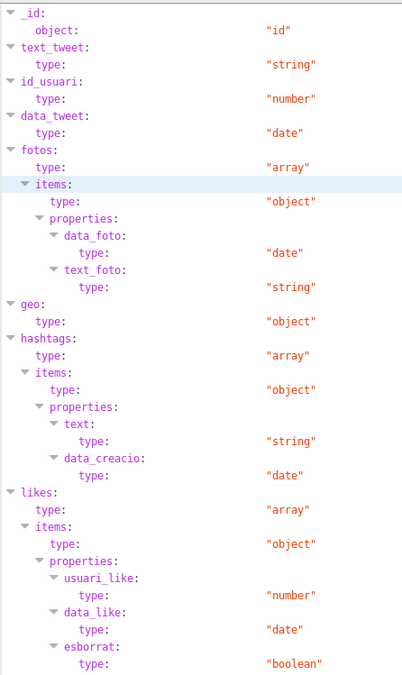
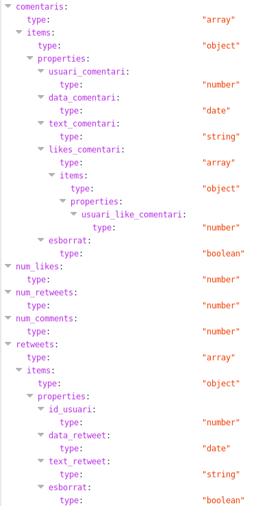

# RDBMS vs NoSQL databases
---
## Objectius

* Donar a conèixer les bases de dades no relacionals.

* Diferències d'ús entre les BBDD relacionals i les no relacionals.

* Mostrar la sintaxi utilitzada en ambdues interfícies.

* Exemples d'ús en entorn "real".

---

## Introducció Mongo i Postgres (principals diferències)

* Postgres

PostgreSQL és una eina _open source_ que permet gestionar bases de dades relacionals.
Les bases de dades relacionals són aquelles que es construeixen amb una estructura específica i que cada taula i camp creat ha de tenir coherència amb la resta de dades.

És important definir una bona estructura per tal de 


* MongoDB

MongoDB també és una eina _opensource_ per gestionar bases de dades, tot i que en aquest cas no són relacionals.
Això ens permet crear esquemes dinàmics, àgils i escalables sense haver de fer grans canvis quan es volen introduir nous elements. Per tant, a diferència de Postgres no s'ha de realitzar una estructura prèvia.

Durant els últims anys hi ha hagut canvis que han fet que s'hagi hagut de variar la manera en com desenvolupem les bases de dades:

* Grans demandes de productivitat i temps de resposta immediat.

* Necessitat de manejar grans canvis en el tipus de dades que s'utilitzen.

* Estructura escalable i amb la capacitat de servir grans audiències amb independència del lloc de treball.

Com a resultat, les bades de dades no relacionals o "NoSQL" com MongoDB han aparegut per tal d'adequar-se a les noves necessitats, com ara:

* Escalabilitat.

* Alta disponibilitat.


---

##  Explicació construcció BBDD

* Explicació estructura en Postgres.


 
* Explicació estructura en MongoDB.



 
 
* Explicació populació de dades
  [Postgres](https://github.com/isx45128227/MongoVsPostgres/tree/master/Postgres/Funcions%20populate)
 
* Explicació pas dades de Postgres a MongoDB (funció row_to_json) 
  (explicar problema amb temps i creació necessària d'indexs). (AMB EXEMPLE)
 
* Explicació diferència queries (La manera en com es fan db.find vs SELECT).

PostgreSQL                                                                                                        | MongoDB
------------------------------------------------------------------------------------------------------------------|-------------------------------------------------------------------------------
`CREATE TABLE tweets (id_tweet bigserial PRIMARY KEY,text_tweet varchar(280) NOT NULL,id_usuari bigint NOT NULL);`| Not Required
`INSERT INTO tweets(id_tweet,text_tweet,id_usuari)VALUES (DEFAULT,'Example tweet',1);`                            | `db.tweets.insert({ id_tweet: 1, text_tweet:'Example tweet', id_usuari: 1 })`
`SELECT * FROM tweets;`                                                                                           | `db.tweets.find()` 
`UPDATE tweets SET id_usuari = 2999 WHERE id_tweet=3000;`                                                         | `db.tweets.update({ id_usuari: 2999 },{ $set: { id_tweet: 3000 } },{ multi: true })`
`DELETE FROM tweets WHERE id_tweet=3000;`                                                                         | `db.tweets.remove({ _id: 3000 })`
`SELECT id_usuari,count(*) FROM tweets GROUP BY id_usuari ORDER BY id_usuari;`                                    | `db.tweets.aggregate([ { "$group": { "_id": "$id_usuari", "num": {"$sum":1}}},{"$project": {"_id": false, "id_usuari":"$_id", "numTweets": "$num"}},{"$sort": { "id_usuari": 1}}])`


---

## Proves de queries lents

* Construcció de queries lents.

* Prova in situ de query lent.

    * Postgres

        * Prova buscant directament a taula tweets.
        
            ```
             EXPLAIN ANALYZE SELECT tweets.id_tweet AS "id_tweet", tweets.text_tweet AS "text_tweet", 
            tweets.id_usuari AS "user_tweet", usuaris.nom AS "nom_user" ,usuaris.username AS "username" ,
            hashtags.hashtag AS "hashtag_used" ,count(likes.id_usuari_like) AS "user_like", 
            count(comentaris.id_usuari_comentari) AS "user_comment", count(seguidors.id_usuari_seguidor) 
            FROM tweets 
            JOIN usuaris ON tweets.id_usuari=usuaris.id_usuari 
            LEFT JOIN hashtagstweets ON tweets.id_tweet=hashtagstweets.id_tweet 
            LEFT JOIN seguidors ON usuaris.id_usuari=seguidors.id_usuari_seguit
            LEFT JOIN hashtags ON hashtagstweets.id_hashtag=hashtags.id_hashtag
            LEFT JOIN likes ON tweets.id_tweet=likes.id_tweet
            LEFT JOIN comentaris ON tweets.id_tweet=comentaris.id_tweet 
            WHERE text_tweet LIKE '%#chip%' GROUP BY tweets.id_tweet,usuaris.id_usuari,hashtags.id_hashtag ORDER BY 1;
            ```
	    
        * Prova buscant a taula hashtags.
	    
            ```
            SELECT tweets.id_tweet AS "id_tweet", tweets.text_tweet AS "text_tweet", 
            tweets.id_usuari AS "user_tweet", count(likes.id_usuari_like) AS "user_like", 
            count(comentaris.id_usuari_comentari) AS "user_comment", count(seguidors.id_usuari_seguidor) 
            FROM tweets 
            JOIN usuaris ON tweets.id_usuari=usuaris.id_usuari 
            JOIN hashtagstweets ON tweets.id_tweet=hashtagstweets.id_tweet 
            LEFT JOIN seguidors ON usuaris.id_usuari=seguidors.id_usuari_seguit
            JOIN hashtags ON hashtagstweets.id_hashtag=hashtags.id_hashtag
            LEFT JOIN likes ON tweets.id_tweet=likes.id_tweet
            LEFT JOIN comentaris ON tweets.id_tweet=comentaris.id_tweet 
            WHERE hashtags.hashtag='chip' GROUP BY tweets.id_tweet;
            ```
            
    * MongoDB
    
    
    
* Comentar resultats.
    

---

## Simulació d'ús en entorn real

* Construcció de queries atac.

* Prova in situ.

    * Postgres
    
        [Atac a Postgres](https://github.com/isx45128227/MongoVsPostgres/tree/master/Postgres/Atac).
    
    
    * MongoDB
    
        [Atac a MongoDB](https://github.com/isx45128227/MongoVsPostgres/tree/master/MongoDB/Atac).


* Comentar resultats.

---

## Manteniment de la base de dades

* Postgres.

* MongoDB.

---

## Conclusions

* Quina és més adient?

* Es pot utilitzar MongoDB en tots els casos?

* Hi ha coherència de dades en ambdues?

## Gràcies per la vostra atenció.
